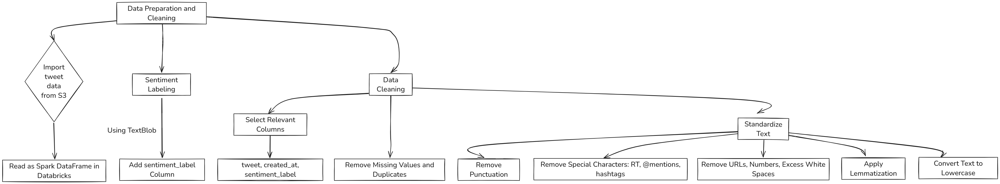
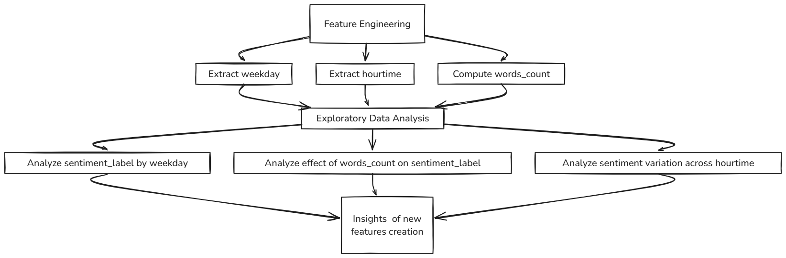
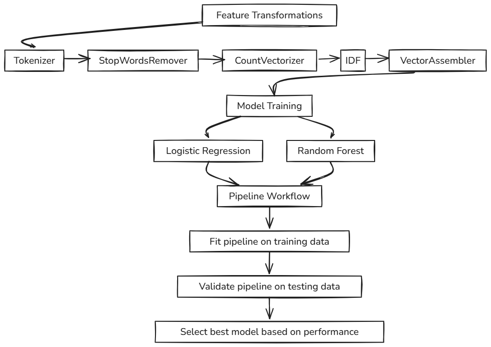
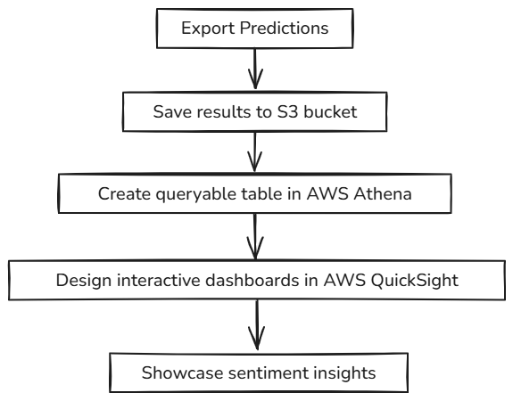
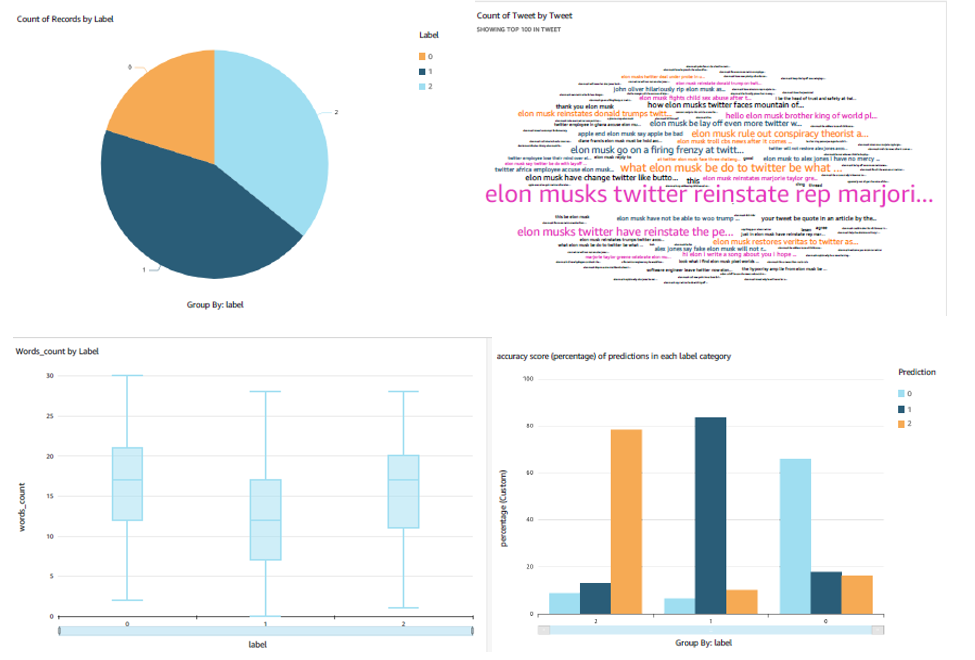

# Sentiment-Analysis

## Overview
This project demonstrates a comprehensive sentiment analysis pipeline leveraging **Spark on Databricks (Community Edition)** to process and analyze tweets. By utilizing distributed computing capabilities and machine learning techniques, the project delivers efficient sentiment predictions and visualization.

### Dataset
- **Source**: Public S3 bucket containing tweets on the topic of Elon Musk collected in November 2022.
- **Objective**: Build an end-to-end ML pipeline to classify tweet sentiments.

---

## Methodology
### 1. Data Preparation and Cleaning

### 2. Feature Engineering and Exploratory Data Analysis (EDA)

### 3. ML Pipeline Development

### 4. Export and Visualization

## Key Highlights
1.  **Distributed Data Processing**:
    - Utilized Spark on Databricks to seamlessly process and analyze large datasets directly from S3, ensuring scalability and efficiency.
2. **Comprehensive Data Preprocessing**:
   - Implemented advanced text standardization techniques, ensuring high-quality inputs for machine learning models.
3. **Feature Engineering and EDA**:
   - Introduced new features and explored their relationships with sentiment labels.
4. **Scalable ML Pipeline**:
   - Developed a robust ML pipeline integrating feature transformations and predictive models.
5. **End-to-End Workflow**:
   - Automated the sentiment prediction workflow from data ingestion to visualization.
   - Integrated predictions with AWS services (S3, Athena and QuickSight) for real-time insights via interactive dashboards.

## Results
- Best model: Logistic Regression achieving **80% accuracy**.
- Interactive dashboard enabled efficient exploration of sentiment trends across time and other variables:
  
  - 0, 1, 2 represent Negative, Neutral, Positive respectively.
  - The first row of images shows the distribution of sentiments in the dataset, highlighting the proportions of each sentiment category.
  - The first image in the second row illustrates the relationship between tweet word count and sentiment. It reveals that neutral tweets tend to have fewer words compared to negative and positive sentiments.
  - The second image in the second row depicts the proportion of predicted sentiments within each actual sentiment category, providing insights into the prediction accuracy for each sentiment class.. 
## Conclusion
This project highlights the power of distributed computing with Spark for large-scale sentiment analysis. By combining Databricks' capabilities with AWS services, we delivered a scalable, end-to-end pipeline from data ingestion to visualization. The approach can be extended to various NLP tasks, making it a valuable template for real-world applications.

